# Dovenity Spa

## Table of Contents:

1. [About](#about)
2. [Business Goals](#business-goals)
3. [User Stories](#user-stories)
4. [Wireframes](#wireframes)
5. [Languages and Technologies used](#languages-and-technologies-used)
6. [Links Used](#links-used)
7. [Media Used](#media-used)
8. [Testing and Results from final testing](#testing-and-results-from-final-testing)
9. [Results from testing](#results-from-testing)
10. [Fixed](#fixed)
11. [Final Product](#final-product)
12. [Deployment](#deployment)
13. [Design and How to use the website](#design-and-how-to-use-the-website)
14. [References](#references)
15. [Issues](#issues)
16. [Limitations](#limitations)
17. [Acknowlegements](#acknowlegements)

## About:

### Dovenity Spa is a fictional website created as a means to let the public know of a sanctuary which exists to allow its guests to relax, indulge in various treatments geared towards improving their mental and physical wellness and as a resort to escape the hassles of daily life in a safe and serene environment.

## Business Goals

1. To increase the bookings of the spa treatments and spa facilites at the Dovenity Spa.
2. To highlight the treatments, facilities and the services available at the Dovenity Spa.
3. To give the public information on how to book at the Dovenity Spa.
4. To give contact us section of the Dovenity Spa.
5. Increase online awareness of Dovenity Spa through Search Engine Optimizarion.
6. To make bookings available online through a form.

## User Stories:

Althought DOvenity Spa is a fictitious spa, to demonstrate a website, possible user stories could include:

1. User Story #1

   I would like details about all the treatments so that I could make a decision which one I would like, if any.

2. User Story #2

   I would like to know about all Dovenity Spa facilities such as the stream room so that I would know which facilities that I could choose from.

3. User Story #3

   I would like to be able to book the Dovenity Spa online so that so that I don't have to go in person to the store or call to make a booking.

4. User Story #4

   I would like to know about testimonials to know if treatment or facilities are good.

5. User Story #5

   I would like to know the opening hours of the Dovenity Spa to book within that time.

6. User Story #6

   I would like to know the rating of the spa.

7. User Story #7

   I would like to join their social media membership to know about sales and upcoming specials.

8. User Story #8

   I would like to know their pricing for all services.

9. User Story #9

   I would like to know the training level of all the staff has had.

## Wireframes:

1. Home Page for mobiles, tablets and PC:
   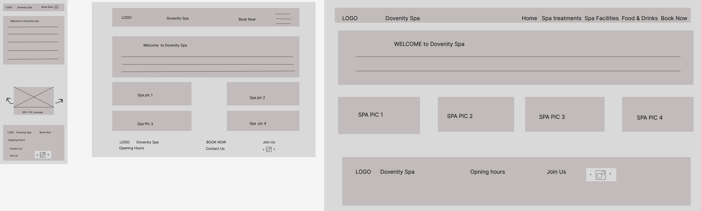

2. Spa Treatments Page for mobiles, tablets and PC:
   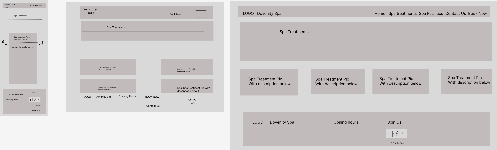

3. Spa Facilities Page for mobiles, tablets and PCs:
   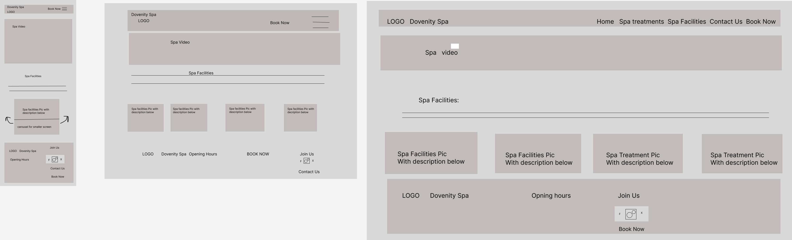

4. Contact Us Form Page for mobiles, tablets and PC:
   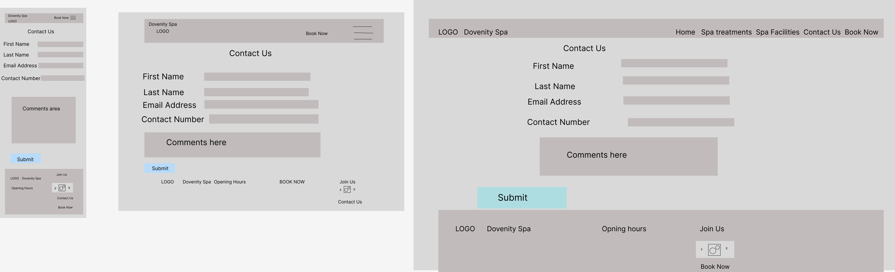

5. Booking Form for mobiles, tablets and PC:
   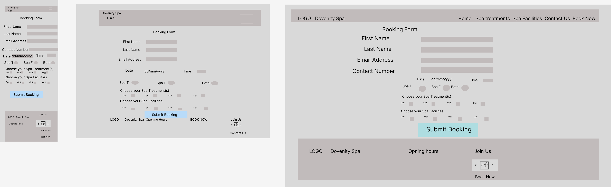

6. Thank you for Booking and Contacting Us Pages for mobiles, tablets and PC:
   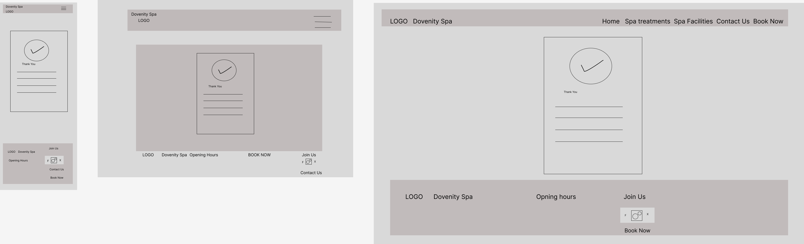

## Languages and Technologies used:

1. HTML
2. CSS
3. Bootstrap version 5.3.8 Library - for navigation bar, footer and other body elements and class implementation for styling .
4. Font Awesome library for icons
5. Google Fonts to import additional fonts
6. Adobe Express to create the Dovenity Spa Logo and favicons.
7. Chrome developer tools, Inspector, to get screenshots of the product webpage on varioussized devices.
8. Nu HTML Validator to check the HTML code.
9. W3C CSS Validator to check the CSS code.
10. Accessibility Checker from accessibilitychecker.org to check the accessibility using WCAG 2.1 and WCAG 2.0 guidelines.

## Links used:

- External links include the social media links below:

1. Facebook:
   

2. Instagram:
   

3. X (formerly known as Twitter):
   

- Internal links included links to

## Media Used:

1. Grantley Hall Video used in spa facilities page:
   ]

## Testing and Results from final testing:

1. Manual testing - The various parts of the website was checked such as the navbar, links, footer links. The various parts were also manually tested on mobile and tablet sizes using inspect and responsiveness checks on the page.

2. Web Accessibility was checked using www.accessibilitychecker.org:
   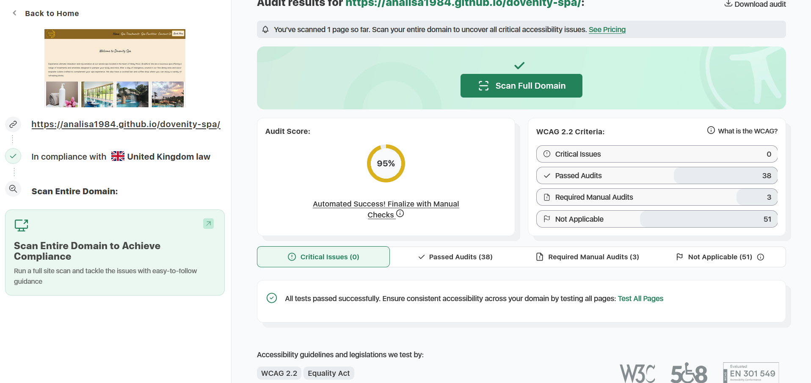

3. HTML validation was done using an online HTML validator, Nu HTML Checker:
   

   - HTML validation showed no errors but there were 2 grouped warnings:
     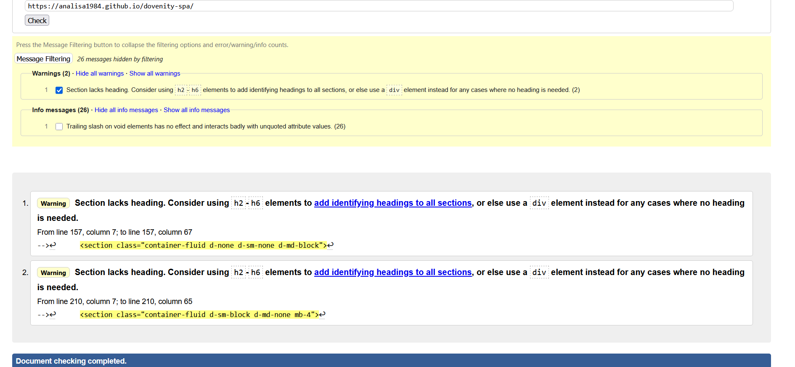
     These warnings are due to section elements being created with no headings in them and instead advises the use of headings or div elements. However, since this element came from a bootstrap 5 card feature, as coded library I chose to leave this element and generally accept it as safe since it is from a renowned library.

     Secondly, the other error showed due to closing slashes made to void elements such as the link element. Although, this (closing slash)code was added by a formatting tool called prettier code, it was also deemed as generally safe and this was the practice in prior HTML versions of coding.

4. CSS validation was done using an online CSS validator, The W3C CSS Validation Service:
   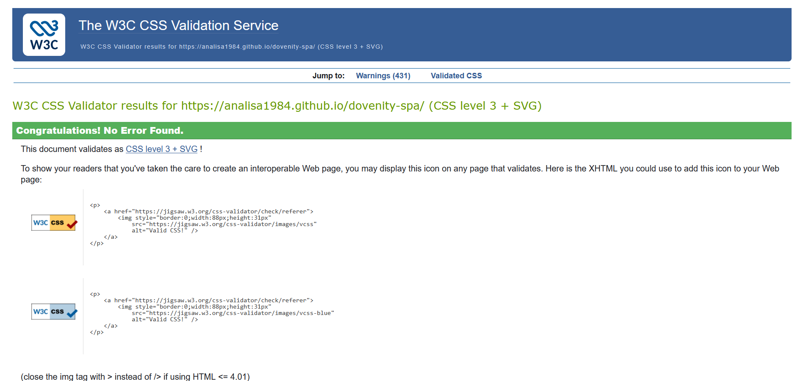

5. Fonts changed in the body of pages to improve readability.

6. Form styling added to make it responsive when going to smaller devices.

7. The logo added to the page also links back to the Home page for easy access to the Home page from multiple routes .

## Results from Testing:

- Low Accessibility Report from Checks done:
  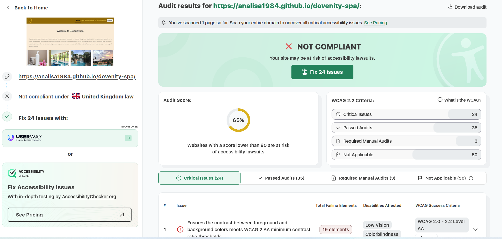

- Accessibility Errors reported from the checks done:
  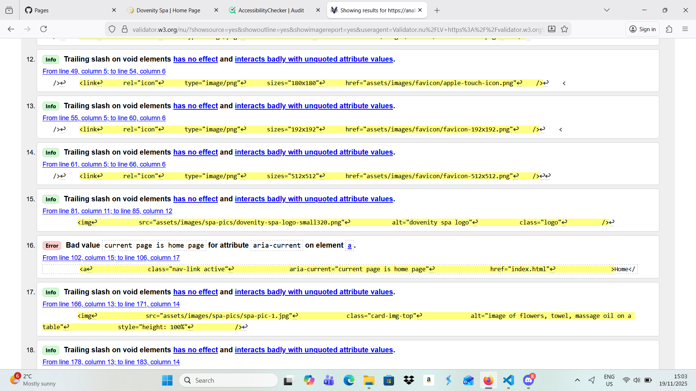

- HTML validation Check with report showing errors:
  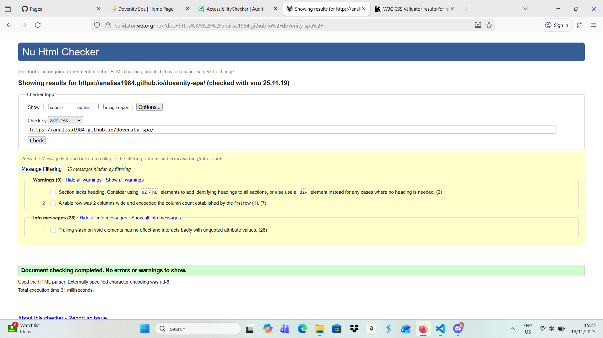

- CSS validation Checks:
  

## Fixed:

- Before the final testings were done, previous testings were done. Previous testings showed low accessibility result and a few errors in the HTML validator. There were no errors reported from the CSS validator.

1. Accessibility errors mainly were fixed by changing the contrast. There was a prior background in the website. However, due to its brightness and high saturations levels of the image, it made reading the text difficult. Although the brightness and saturations levels were reduced, it was still difficult to read the text and visibity was hampered by the background which was very distracting.
   Fixed: this was resolved by changing the background to a more neutral color and something that would blend with the header and footer background to give some continuity pattern in the product design.

2. Accessibility: From testing it was revealed that not all links and elements that aria-labels. For accessibitlity purposes this needed to be changed.
   Fixed: Aria-labels were added to labels, forms, buttons, images had alt text attributes. Caption was added for the table.

3. Accessibility: the spa booking form labels were to close making visibility and reading more difficult.
   Fixed: Spacing via padding, margins (bootstrap classes mostly) were used and   for the line spaces.

4. Accessibility: Arial current can only have certain values.
   Fixed: the current pages had the value of page (for the current page).

5. HTML Validation error: the results showed that there were two columns in the table with the row of opening hours but the first column was not being used.
   Fixed: the first column was deleted and in the column with opening hours, a colspan of 2 was added to show the column neatly.

6. HTML Validation error: Initially there were 2 semantic errors reported. One page had headings not in order and due to the hierarchy they should follow, h1, h2, h3, h4, h5 then h6 headings. Secondly all pages should at least have an h1 heading.
   Fixed: the Semanic hierarchy was then reviewed on all pages to ensure they are fixed in order from h1 to h6, also it was made certain that all pages had an h1 heading.

7. Design: The navigation bar template was obtained from bootstrap 5.3.8. In place of the navbar an image was inserted and due to the navbar being in a container-fluid class, it pushed the border down under the image as the screen became smaller.
   Fixed: the image was position absolute and that resolved the border issue.

## Final Product:

This fictional product was designed to meet the goals of both the business as well as the potential users.

- Smaller devices such as mobile phones:
  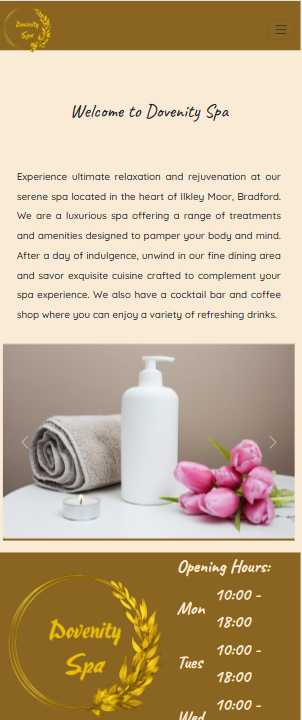

- Intermediate devices such as Ipad or tablets:
  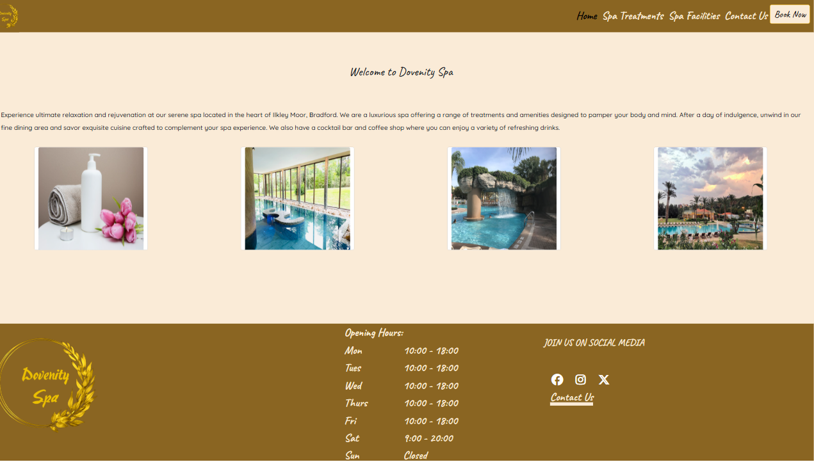

- Medium to Large sized devices such as laptop:
  

- Large devices such as PC:
  

## Business Goals and User stories met:

1. Business-Goal #1:
   To increase the bookings of the spa treatments and spa facilites at the Dovenity Spa.

Call to action is the Book Now links (styled as buttons) located on every page in the navigation bar as well as every treatment in the spa treatment page.

- Book Now Link in ALL pages in Navigation bar:
  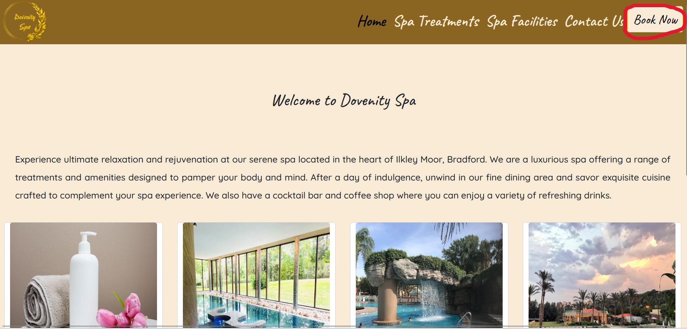

- Book Now Links in Spa Treatments page:
  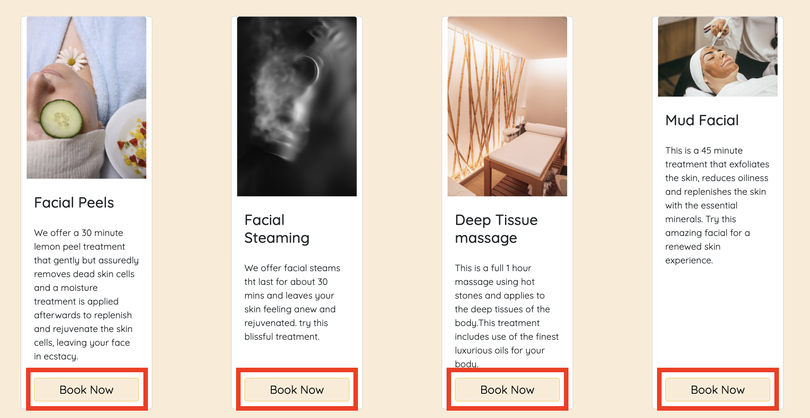

2. Business-Goal #2:
   To highlight the treatments, facilities and the services available at the Dovenity Spa.

Call to Action is the Spa Treatment page and Spa Facilities Page. These can be access from the navigation bar on top located on every page.

- Spa Treatment Page:
  

- Spa Facilities Page:
  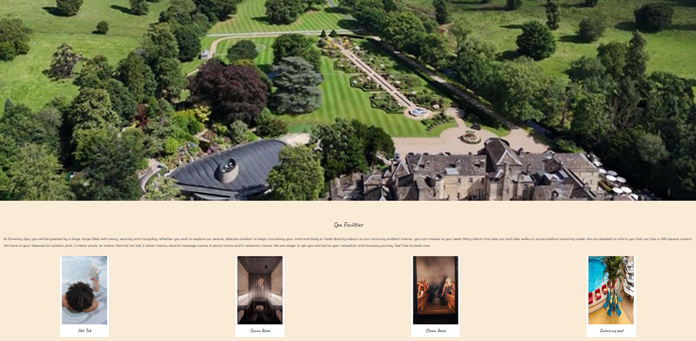

3. Business-Goal #3:
   To give the public information on how to book at the Dovenity Spa.

Call to Action is the Spa Booking Forms with is obtained by clicking on the Book Now links (styled as buttons) on navigation bar or from the treatment page.

- Spa Booking Form (obtained when Book Now link is clicked):
  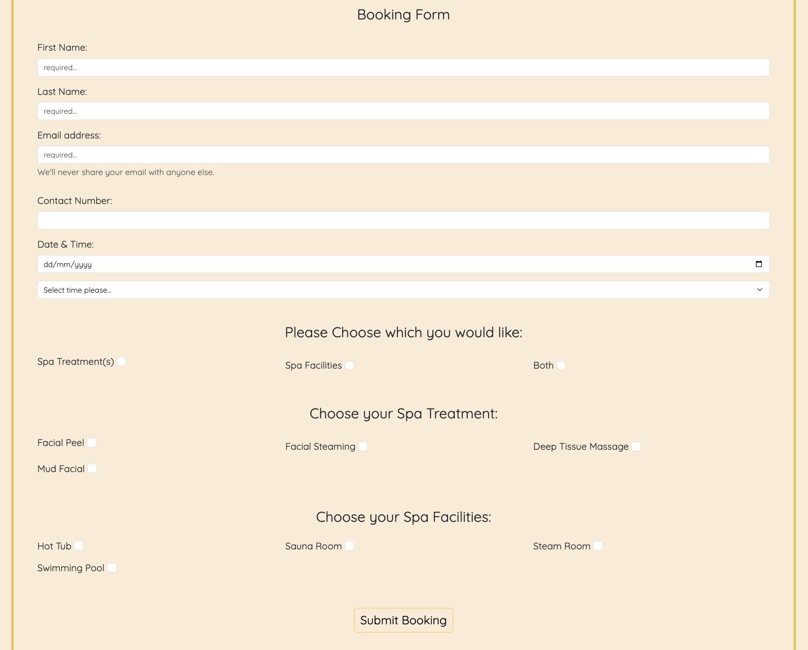

4. Business-Goal #4:
   To give contact us section of the Dovenity Spa.

Call to action is the Spa Contact Us link (found in the navigation bar on top and the footer below on all pages) which leads to the Contact us form.

- Spa Contact Us Form and Contact Us link in the navigation bar
  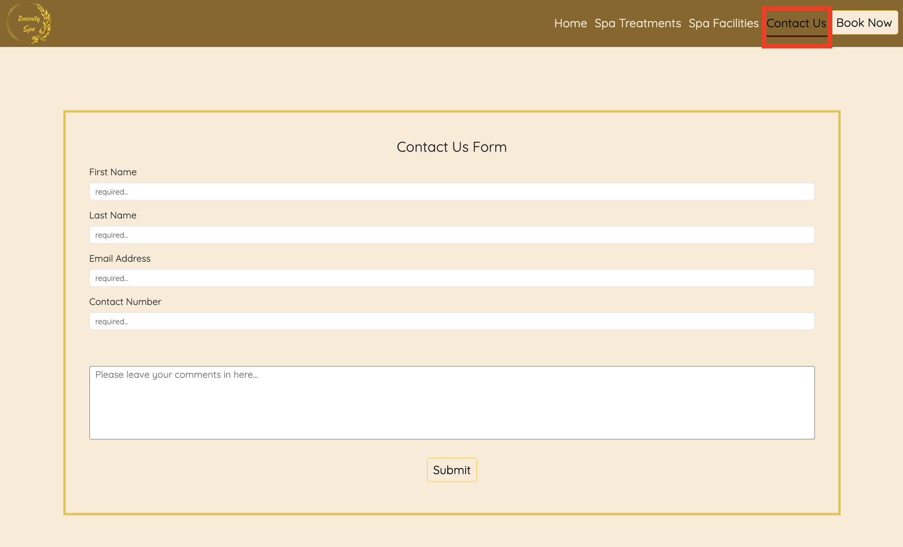

- Contact Us link in the footer
  .png>)

## Deployment:

Deployed to GitHub Pages on 17th November 2026.

- Local development environment
  Creating a local envrioment for future developers:

1. Create a github account on `github.com/signup` or login using `github.com/login`
2. Install git on your laptop, it is availible here for multiple operating systems `https://git-scm.com/install`
3. Install VS Code on your machine `https://code.visualstudio.com/download`
4. From the file menu `Open Folder` and select where you want to store the code
5. Open VS code, in the terminal window and open a bash terminal. This will be availible in Windows Mac and Linux
6. Clone the repository using `git clone https://github.com/Analisa1984/dovenity-spa.git` (no login will be required as dovenity spa is a public repository)

- Deploying via Github pages
  Creating a publicly accessible website:

1. Login to Github `github.com`
2. Go to the Dovenity Spa repository `https://github.com/Analisa1984/dovenity-spa`
3. Click Settings
4. Change to deploy branch and select `Main`
   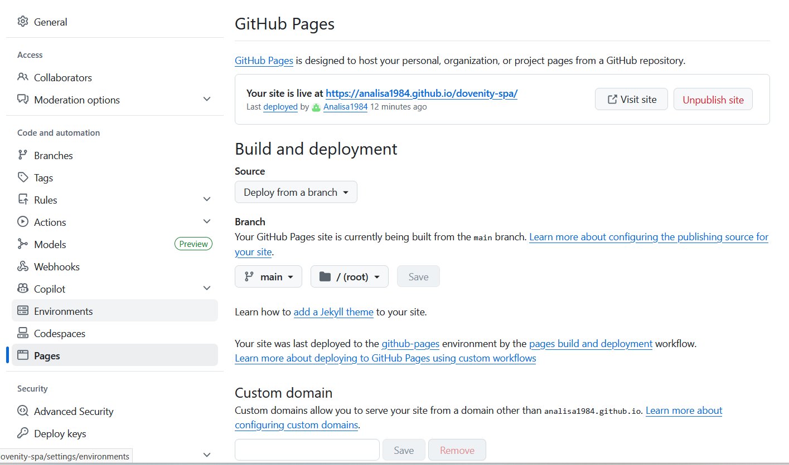
5. Push changes to the main branch, this will automatically deploy the website.

## Design and How to use the website:

- This product (Dovenity Spa website) was designed to serve both the business goals and user stories.
  The purpose of this product was to be a means to increase awareness of Dovenity Spa and to detail the treatments, facilities, services that this spa offer. As well as to serve the public that require and use spa services. Certain details have been left out due to time constraints and is mentioned under issues.

- This product has a clear and simple design made easy for users to navigate by using the same design format for all the pages.

  - Each page has a navigation bar on top where the links are shown and for smaller devices instead of the navigation links there is a dropdown burger menu. Also there is a logo on the top left.
  - Each page has a footer section with the logo on the bottom left, the middle has a table with the opening hours and the bottom right has links to the social media links and a contact us section
  - Both the navigation bar and the footer are the same color on all screen sizes and on all pages.
  - the product was designed to be responsive to all screen devices so that words on paragraphs or forms do not overflow the borders or tables.
  - In ALL pages there are links to the Home page and clicking on the logo (which is in all pages) will return the user to the home page.
  - The between section of the navigation bar on top and the footer below vary with each page. However the background color is the same and matches with the top and bottom color to give continuity.

- On loading the website, you are first brought to the Home page which gives a welcome. The top section has a navigation bar. The navigation bar has a logo on the left and 5 links on the right side of the navbar. The first link is the Home page. The second link is the spa treatments the third link is the spa facilities which is then followed by the contact us then a book now button. The call to action is the book now button, which is actually a link that is styled like a button (as thi project uses only HTML, CSS and Bootsrtap 5.3.8).
  The welcome section in the body is a paragraph gives details about the location, services of the spa.

- Next, the footer contains the dovenity spa logo, which also links to the home page. The footer also shows the opening hours in a table format and then there are the social links to: facebook, instagram and X (formerly twitter). Finally, there is a contact us link.

- If the user clicks on any elements on the navigation bar, the following will occur:

1. Clicking on the logo leads user to the Home page.
2. Clicking on the Home link leads to Home page.
3. Clicking on the Spa Treatments Page leads to the various treaments offered.
4. Clicking on the Spa Facilities page leads to the various facilites available at the spa.
5. Clicking on the Contact Us link will take the user to the contact us form.
6. Clicking on any of the Book Now links (styled as buttons) will lead to the booking form.
7. Clicking on the Submit links (styled as buttons) will get a thank you form to the user.

- If the user looks at the footer, they will see:

1. The Dovenity Spa logo which is clickable and sends the user to the Home Page.
2. The opening hours of the spa
3. A Join us section which contain media links for Facebook, Instagram and X (formerly known as Twitter), these links sends the user to the respective social media's homepage (as Dovenity Spa is not a real institute).
4. A Contact Us link thank sends the user to the Contact Us form.

- All Pages have the same Navigation bar as well as the footer.

- The body element of all pages have various content as follows:

1. Home page has a welcome section which tells about the Dovenity Spa followed by various pictures on the screen. A carousel feature was added to the mobile and smaller devices so that the pictures would not be too fitted and for better visibility.

2. Spa Treatment Page has a worded paragraph about the treatments an blow are 4 treatments described in a card each with a pic above, with the option to click the Book Now link (styled as a button) below. The images were widened and a small portion of the sides were left to give a white border to the sides. This design was intentional.

3. Spa Facilities has a video directly below the navigation bar, meant to show the outdoor grounds of the building to give potential users a feel of the serentity that the establishment offers. Following the video, a paragrah ensues which describes the facilites outdoor and indoor. Below the paragraph is a series of cards with pictures then description.

4. The Contact Us Page, apart from teh Navigation bar as well as the Footer is a Form where the user can full out to alert staff or the establishment of any issues. The form has compulsory areas to be filled out in case the submit button is clicked by accident. This allows the user to make sure important details are filled out before submission as well as to ensure that the company does not receive blank emails.

5. The Booking Form also has a form element whereby certain fields were required before submission is possible.

6. The Thank you for Contacting Us Page and Thank You for Booking Page also have A Note with a tick symbol with a green background with the Thank you message. This was intentionally done to give the user a sense of comfort tomake them aware the form was sent.

## References:

1. Grantley Hall Video from Pexels.com/video/grantley-hall-27693495/ by David Pickup.
2. Unsplash image for Home page - plastic pump bottle beside pink tulips by Camille Brodard.
3. Unsplash image for Home page - people in swimming pool during day time by Mary McDonald.
4. Unsplash image for Home page - large indoor pool with a bench next to it by Judith Girard Marczak.
5. Unsplash image for Home Page - outdoor swimming pool at a resort by Zheka Boychenko.
6. Unsplash image for Spa Treatments page - woman wearing a blue robe lying with a cucumber by Adrian Matroc.
7. Unsplash image for Spa Treatmnents page - blurry photo of a steamer by Jens Riesenberg.
8. Unsplash image for Spa Treatments page - a bed with wooden frame by Flavio Anibal.
9. Unsplash image for Spa Treatments page - man wearing a mud mask by Rosa Rafael.
10. Unsplash image for Spa Facilities page - cruise ship deck by TravelPriceWatch.
11. Unsplash image for Spa Facilities page - boy reading book in hot tub by Michael Chiara.
12. Unsplash image for spa Facilities page - brown and white floral round table by HUUM Sauna.
13. Unsplash image for Spa Facilities page - a couple of people that are sitting in a sauna by HUUM Sauna.
14. Bootstrap 5.3.8 version library utlized.
15. Nu HTML Validator.
16. W3C CSS Validator.
17. Accessibility Checker from accessibilitychecker.org.

## Issues:

-

## Limitations:

- Due to time limits more user stories could not have been implemented in the final product such as: testimonials, pricing for all services, rating of the spa, training level of the spa staff, online payment options for the services offered at the spa.

- A foods and drinks page had been started but due to time contraints this had to be halted.

## Acknowlegements:
